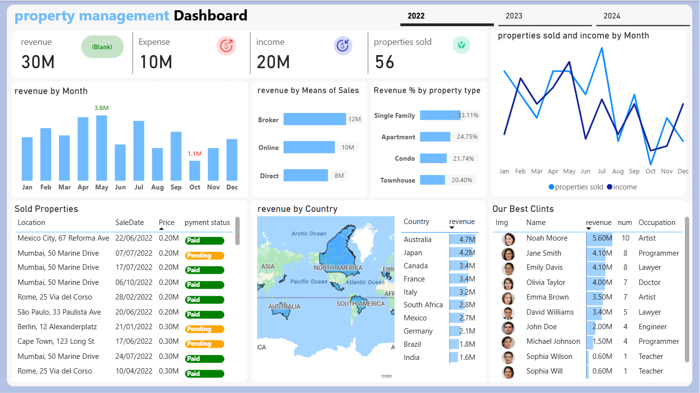
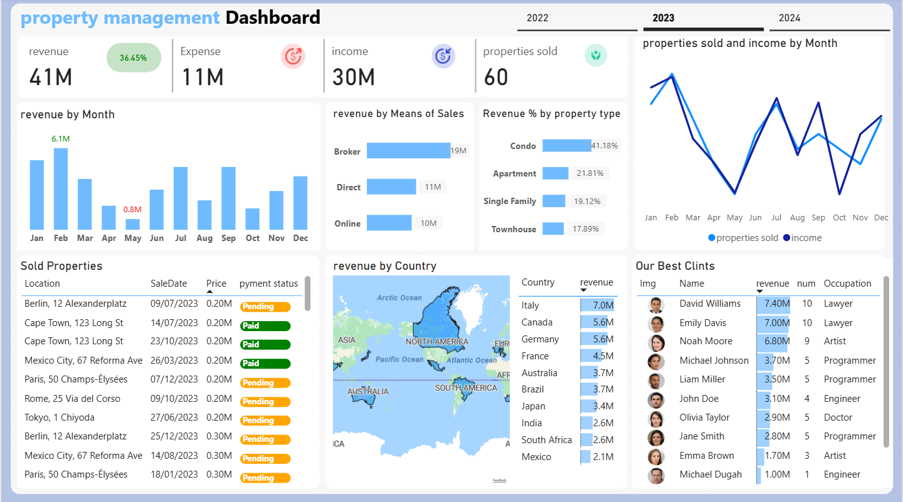
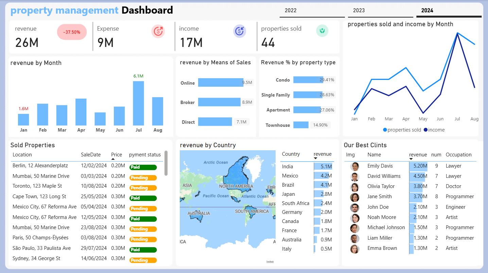

# 🏠 Property Management Analytics Dashboard

<div align="center">


[](https://powerbi.microsoft.com)
[](.)
[](.)
[](.)

> **An end-to-end real estate analytics solution** tracking revenue, expenses, property sales, and client performance across 3 years and 10+ global markets.

</div>

---

## 📊 Dashboard Previews

| 2022 | 2023 | 2024 (YTD) |
|------|------|------------|
|  |  |  |
| Revenue: **$30M** | Revenue: **$41M** ↑36.45% | Revenue: **$26M** ↓37.50% YTD |

---

## 🔍 Project Overview

This interactive dashboard was built to provide **real-time business intelligence** for a global property management company. It consolidates data from multiple markets into a single decision-making interface — enabling leadership to monitor financial health, track sales velocity, and identify top-performing clients instantly.

### 🎯 Business Questions Answered
- Which months and channels generate the most revenue?
- How are different property types performing?
- Which countries are the strongest markets?
- Who are our highest-value clients, and what drives their engagement?
- How does year-over-year performance compare?

---

## 📈 Key Metrics Summary

| Metric | 2022 | 2023 | 2024 (Jan–Aug) |
|---|---|---|---|
| 💰 **Total Revenue** | $30M | $41M | $26M |
| 🏦 **Expenses** | $10M | $11M | $9M |
| 📊 **Net Income** | $20M | $30M | $17M |
| 🏡 **Properties Sold** | 56 | 60 | 44 |
| 📈 **YoY Revenue Growth** | — | +36.45% | -37.50%* |

> *2024 figures cover January–August only; annualized performance remains competitive.

---

## 🌍 Geographic Intelligence

The dashboard maps revenue across **10+ countries**, revealing strategic market shifts:

| Rank | 2022 Leader | 2023 Leader | 2024 Leader |
|------|-------------|-------------|-------------|
| 🥇 | Australia ($4.7M) | Italy ($7.0M) | India ($5.1M) |
| 🥈 | Japan ($4.2M) | Canada ($5.6M) | Mexico ($4.2M) |
| 🥉 | Canada ($3.4M) | Germany ($5.6M) | Brazil ($4.1M) |

**Key Insight:** The business has successfully diversified from Pacific-focused (2022) to European-led (2023) and now Emerging Market-led (2024) revenue generation — a sign of deliberate portfolio expansion.

---

## 🏢 Property Type Performance

Revenue distribution across property types has evolved significantly:

```
2022                        2023                        2024
────────────────────        ────────────────────        ────────────────────
Single Family  33.11%  →    Condo         41.18%  →    Condo         29.41%
Apartment      24.75%       Apartment     21.81%        Single Family 28.63%
Condo          21.74%       Single Family 19.12%        Apartment     27.06%
Townhouse      20.40%       Townhouse     17.89%        Townhouse     14.90%
```

**Trend:** Condo demand surged in 2023 before normalizing. The 2024 data shows a more balanced portfolio with all types performing closely — reduced concentration risk.

---

## 💼 Sales Channel Analysis

| Channel | 2022 | 2023 | 2024 |
|---------|------|------|------|
| 🏢 Broker | $12M | $19M | $8.9M |
| 💻 Online | $10M | $10M | $9.5M |
| 🤝 Direct | $8M | $11M | $7.1M |

**Key Insight:** Online sales have been the most **consistent channel** across all three years, while broker performance is more volatile. In 2024, Online has overtaken Broker for the first time — suggesting a shift in buyer behavior worth monitoring.

---

## 🏆 Top Client Analysis

### Hall of Fame — Multi-Year Top Performers

| Client | Occupation | 2022 | 2023 | 2024 | Total Est. |
|--------|------------|------|------|------|------------|
| Emily Davis | Lawyer | $4.10M | $7.00M | $5.20M | **$16.3M** |
| David Williams | Lawyer | $3.40M | $7.40M | $4.50M | **$15.3M** |
| Noah Moore | Artist | $5.60M | $6.80M | $2.10M | **$14.5M** |
| Olivia Taylor | Doctor | $4.00M | $2.90M | $3.80M | **$10.7M** |
| John Doe | Engineer | $2.00M | $3.10M | $2.10M | **$7.2M** |

**Insight:** Lawyers dominate the top-client segment — a demographic worth targeting in marketing strategy.

---

## 🛠️ Technical Stack

```
📁 Project Structure
├── 📊 Dashboard Files
│   ├── PropertyDashboard.pbix       # Main Power BI file
│   └── DataModel.xlsx               # Source data model
│
├── 🖼️ assets/
│   ├── 2022.png                     # Dashboard snapshot - 2022
│   ├── 2023.png                     # Dashboard snapshot - 2023
│   └── 2024.png                     # Dashboard snapshot - 2024
│
└── 📖 README.md
```

### Tools & Technologies
- **Visualization:** Microsoft Power BI Desktop
- **Data Modeling:** DAX (Data Analysis Expressions)
- **Data Source:** Excel / SQL Database
- **Design:** Custom theme with responsive layout

---

## ⚙️ Key DAX Measures Used

```dax
-- Year-over-Year Revenue Growth
YoY Growth % = 
DIVIDE(
    [Total Revenue] - CALCULATE([Total Revenue], PREVIOUSYEAR('Date'[Date])),
    CALCULATE([Total Revenue], PREVIOUSYEAR('Date'[Date]))
)

-- Net Income
Net Income = [Total Revenue] - [Total Expenses]

-- Revenue by Property Type %
Revenue % by Type = 
DIVIDE([Revenue by Type], [Total Revenue], 0)
```

---

## 🚀 How to Use

1. **Clone this repository**
   ```bash
   git clone https://github.com/mostafarabee742-create/property-management-dashboard.git
   ```

2. **Open the dashboard**
   - Install [Power BI Desktop](https://powerbi.microsoft.com/desktop/) (free)
   - Open `PropertyDashboard.pbix`

3. **Explore the data**
   - Use the **year tabs** (2022 / 2023 / 2024) to switch time periods
   - Click on **map regions**, **property types**, or **chart elements** to cross-filter
   - Use the **client table** to drill into individual performance

4. **Connect your own data** *(optional)*
   - Go to `Transform Data > Data Source Settings`
   - Point to your own Excel/SQL source following the same schema

---

## 💡 Analytical Insights & Recommendations

Based on the 3-year analysis:

1. **Double down on the Online channel** — it's the only channel with consistent growth and is now the #1 revenue driver in 2024.

2. **Prioritize the Lawyer demographic** — they represent the highest revenue per client and have multi-year loyalty. Consider a referral or loyalty program.

3. **Expand in India & Brazil** — both are 2024's top-growing markets, signaling strong demand with room for portfolio expansion.

4. **Monitor the Condo segment** — after peaking at 41% in 2023, condo revenue share has declined. Evaluate whether this is market saturation or a pricing issue.

5. **Address the high Pending payments** — 2023 and 2024 show a sharp increase in "Pending" payment status vs. "Paid." This represents cash flow risk worth investigating.

---

## 📬 Contact

**Author:** Mostafa Rabee  
**Role:** Data Analyst  
**LinkedIn:** [linkedin.com/in/mostafa-rabee74](https://www.linkedin.com/in/mostafa-rabee74)  
**Email:** [mostafarabee742@gmail.com](mailto:mostafarabee742@gmail.com)  
**GitHub:** [github.com/mostafarabee742-create](https://github.com/mostafarabee742-create)

---

<div align="center">

⭐ **If you found this project useful, please give it a star!** ⭐

*Built with ❤️ by Mostafa Rabee | Data Analyst*  
*Data-driven decisions for smarter real estate*

</div>
